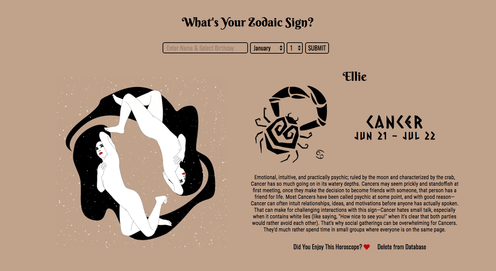

# Astrology Express App

### Goal: Create an astrology app where users can enter their name and birthday and get information about their zodiac sign.

## Design and Development:
**Tech Used** HTML, CSS, JavaScript, Node, Express, EJS template, MongoDB:
Using Node, Express, JS, and MongoDB to store and access data, this app allows users to enter their birthday and get information about their zodiac sign.

## Reflections:
As an avid astrology follower, I loved building this application! It was my first time using EJS so there were definitely some elements that probably could've been in client-side JS vs. server-side. Images used are not my own.

## Installation
1. Clone repo
2. run `npm install`

## Usage
1. run `node server.js`
2. Navigate to `localhost:<####>`
